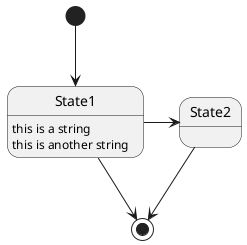

readme.mda
동해물과 백두산이 마르고 닳도록 하느님이 보우하사 우리나라 만세

# test

test

### Sequence diagram with lang `uml`

```uml
@startuml
Alice -> Bob: Authentication Request
Bob --> Alice: Authentication Response
Alice -> Bob: Another authentication Request
Alice <-- Bob: another authentication Response
@enduml
```

### State diagram with lang `puml`




#### Code block without lang `uml`

```
@startuml
Foo -> Bar
@enduml
```

#### `uml` code block does not starts with `@start`

```uml
foo
bar
baz
```

