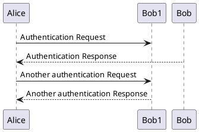

demo: 

http://uml.mvnsearch.org/github/wicksome/test/blob/master/uml/test.puml

see:

http://uml.mvnsearch.org/index_github.jsp

```uml
@startuml
Alice -> Bob1: Authentication Request
Bob --> Alice: Authentication Response

Alice -> Bob1: Another authentication Request
Alice <-- Bob1: Another authentication Response
@enduml
```



